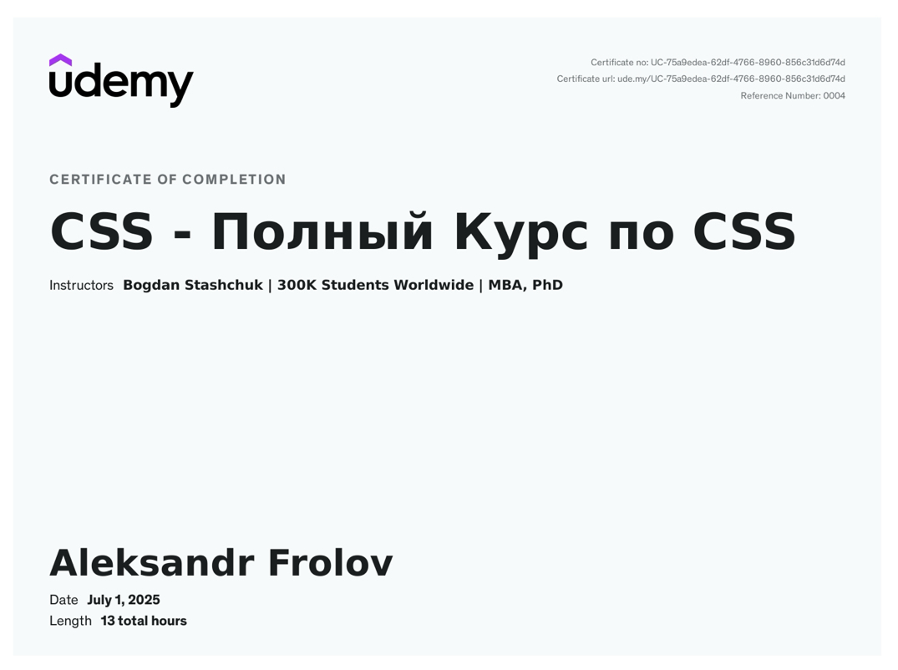

<a href="https://www.linkedin.com/in/AleksandrFrolov2809">

</a>

# 🤝 Hey there! I'm Alex

### 💻 Frontend Developer | UI & UX Enthusiast

From an early age, I’ve been passionate about creating beautiful and functional websites. I started with marketing and landing pages on Tilda and Taplink, which helped me understand the value of design and user experience.

At 16, I began studying frontend development, and since then I’ve been fully focused on web development. I’m constantly learning new things, improving my skills, and enjoying the process of building high-quality interfaces.

In an era where AI writes code, it’s important to think not only about how it works, but also about how people use it. I pay special attention to usability, simplicity, and user experience.

---

## 📮 Contact & Social

<p align="center">
   <a href="https://instagram.com/alexfrxx"></a>
  <a href="https://www.linkedin.com/in/AleksandrFrolov2809/"></a>
<a href="mailto:fr.280907@gmail.com"></a>
<a href="https://x.com/AleksandrFr2007"></a>
<a href="https://t.me/alexFrxx"></a>
  <a href="https://alexfrxx.vercel.app"></a>
</p>
<p align="center"><em>Let’s build something meaningful together.</em></p>

---

## 💻 Technology Stack

### Languages


### UI Libraries & Styling


### Build Tools & Package Managers


### Version Control & CI/CD


### Cloud & DevOps


### AI & Neural Networks


### CMS & Web Builders


### Development Tools & IDEs


---

## 🎓 Certificates

<div align="center">
<a href="https://www.udemy.com/certificate/UC-b9a4b2b1-9e7a-455a-a183-95275dcb6a1c/" target="_blank">
  
</a>
<a href="https://www.udemy.com/certificate/UC-5415c020-00e3-4782-8f4b-57173769dca3/" target="_blank">
  
</a>
<a href="https://www.udemy.com/certificate/UC-75a9edea-62df-4766-8960-856c31d6d74d/" target="_blank">
  
</a>
</div>

---

### ⏳ Time Invested in Coding

<!--START_SECTION:waka-->

```txt
Total Time: 80 hrs 6 mins

SCSS          22 hrs 40 mins        ███████░░░░░░░░░░░░░░░░░░   28.28 %
HTML          18 hrs 28 mins        █████▓░░░░░░░░░░░░░░░░░░░   23.04 %
CSS           15 hrs 5 mins         ████▓░░░░░░░░░░░░░░░░░░░░   18.81 %
JavaScript    13 hrs 40 mins        ████▒░░░░░░░░░░░░░░░░░░░░   17.05 %
TypeScript    4 hrs 44 mins         █▒░░░░░░░░░░░░░░░░░░░░░░░   05.91 %
Less          2 hrs 10 mins         ▓░░░░░░░░░░░░░░░░░░░░░░░░   02.71 %
JSON          1 hr 36 mins          ▓░░░░░░░░░░░░░░░░░░░░░░░░   02.00 %
Image (svg)   1 hr 12 mins          ▒░░░░░░░░░░░░░░░░░░░░░░░░   01.50 %
Markdown      16 mins               ░░░░░░░░░░░░░░░░░░░░░░░░░   00.35 %
YAML          8 mins                ░░░░░░░░░░░░░░░░░░░░░░░░░   00.17 %
```

<!--END_SECTION:waka-->

---

## 📈 Github Stats & Activity Graph

<div align="center">
 
  
</div>

<div align="center">
<a href="https://github.com/alexfrxx/github-readme-activity-graph#highcontrast">

</a>
  

</div>

<div align="center">
  

</div>

---

### 📁 Project Structure

```
.
├── .github/             # GitHub Actions workflows & configs
├── images/              # Assets, banners, and graphics
├── profile-3d-contrib/  # 3D contribution visualizations
├── package.json         # Project metadata & dependencies
└── README.md            # This file
```

---

### 📍 Location

<!-- Cracow Geographic Area -->

```geojson
{
  "type": "FeatureCollection",
  "features": [
    {
      "type": "Feature",
      "id": 1,
      "properties": {
        "ID": 0,
        "name": "Kraków Metropolitan Area"
      },
      "geometry": {
        "type": "Polygon",
        "coordinates": [
          [
            [
              19.7922,
              49.9679
            ],
            [
              20.217,
              50.126
            ]
          ]
        ]
      }
    }
  ]
}
```

---

<p align="center"><em>Thank you for visiting my profile — the projects are listed below🔻</em></p>
